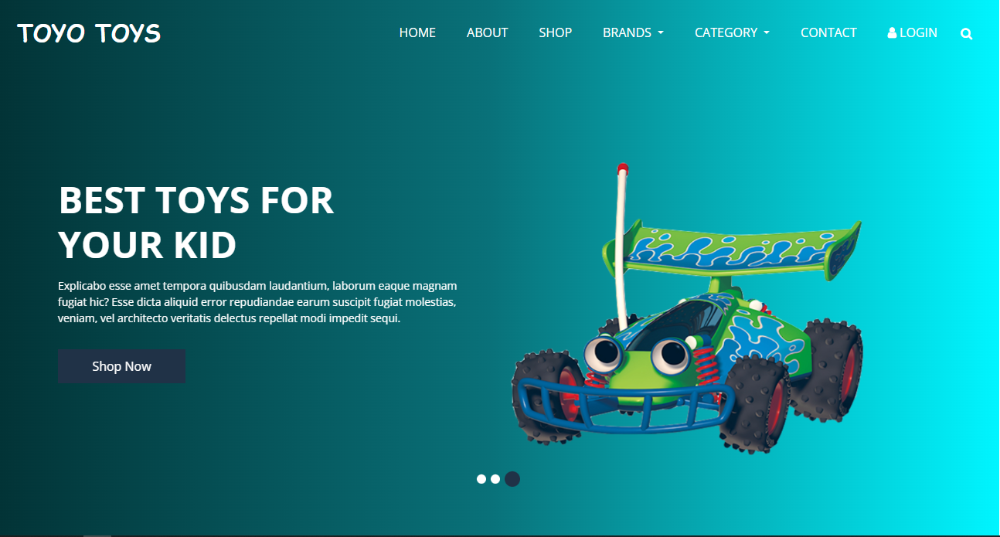
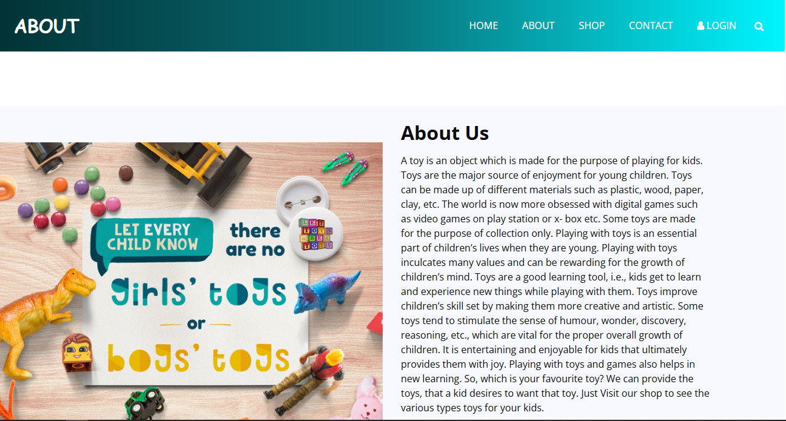
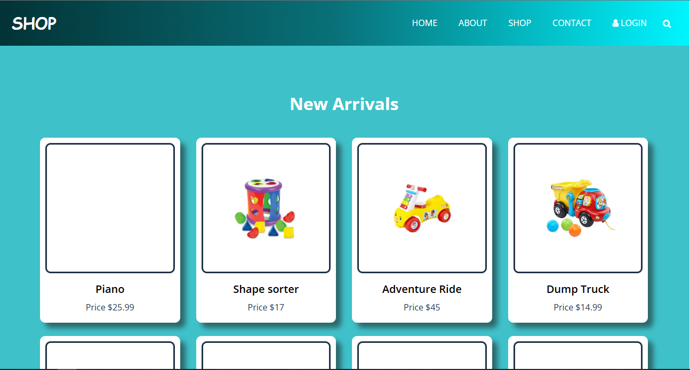
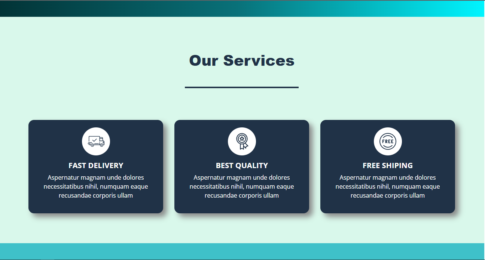
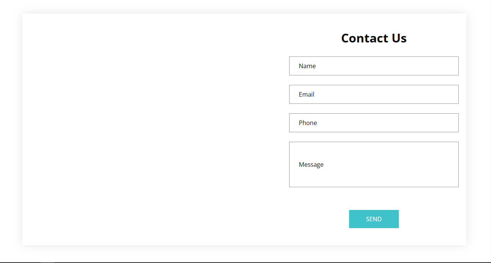
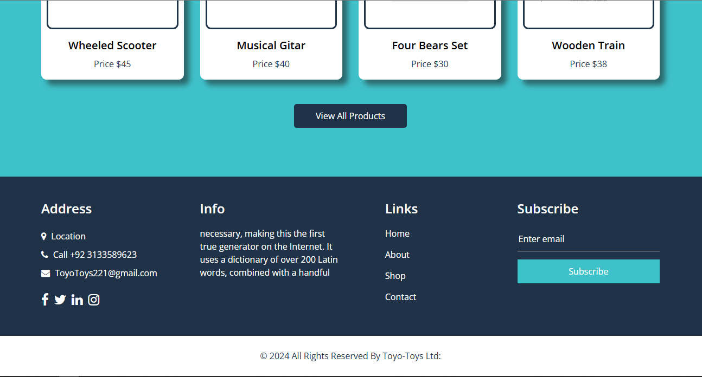

# Toyo-Toys E-Commerce Website 🌟

Toyo-Toys is a responsive e-commerce website developed as part of my E-Project at Aptech Learning Institute. This project showcases my proficiency in front-end web development using HTML, CSS, JavaScript, Bootstrap, and jQuery. The site features dynamic user interactions, a modern UI/UX design, and optimized performance for an engaging online shopping experience. 🛒✨

## Technologies Used 🚀
- : For structuring the content.
- : For styling and layout.
-  : For dynamic interactions and functionality.
-  : For responsive design and pre-built components.
-  : For simplified DOM manipulation and event handling.

## Features ⭐
- Responsive design that adapts to various screen sizes 📱💻.
- Dynamic product listings and user interactions 🛍️.
- Modern and clean UI/UX design ✨.
- Optimized performance for fast load times ⚡.

## Installation ⚙️
1. Clone the repository:
   ```bash
   git clone https://github.com/syedabdulbasitali1/Toyo-Toys-E-Commerce-Website.git
2. Navigate to the project directory:
   ```bash
    cd Toyo-Toys-E-Commerce-Website
3. Open the index.html file in your browser to view the website 🌐.

## Usage 💡
- Navigate through the product categories to browse items 🏷️.
- Use the search bar to find specific toys 🔍.
- Add items to the cart and proceed to checkout 🛒.

## License 📝
This project is licensed under the MIT License - see the LICENSE file for details.

## Contact 📫
For any questions or feedback, please reach out to:

- Email: arenag277@gmail.com 📧
- LinkedIn: www.linkedin.com/in/syedabdulbasitali 🔗

## Screenshots 📸
Here are some screenshots of the website:


*Homepage view with product listings.*


*You can know about us.*


*Detailed view of a toy product.*


*Our Services for customers.*


*You can contact us.*


*Footer with contact and information.*

 
